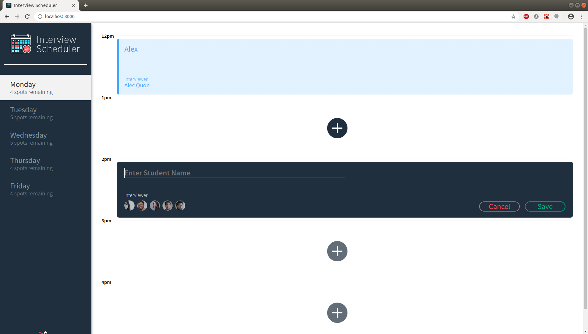
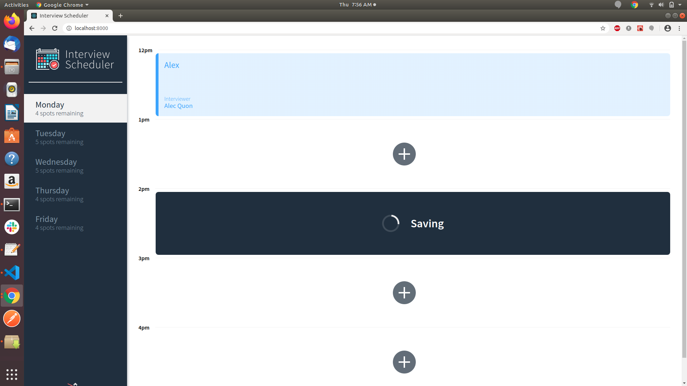
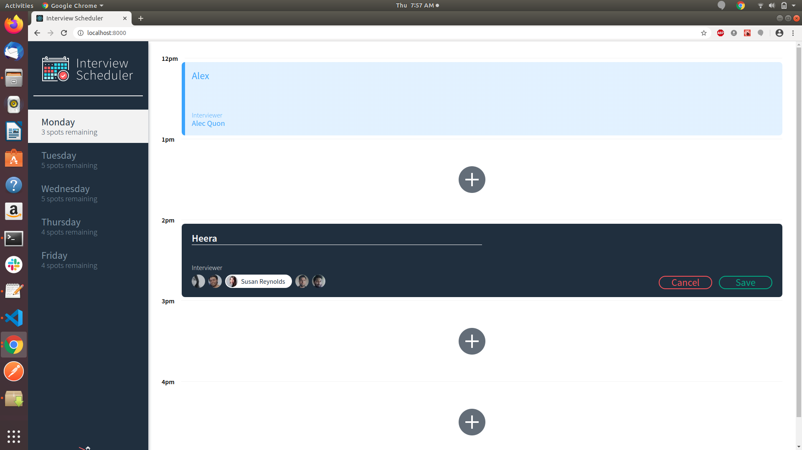
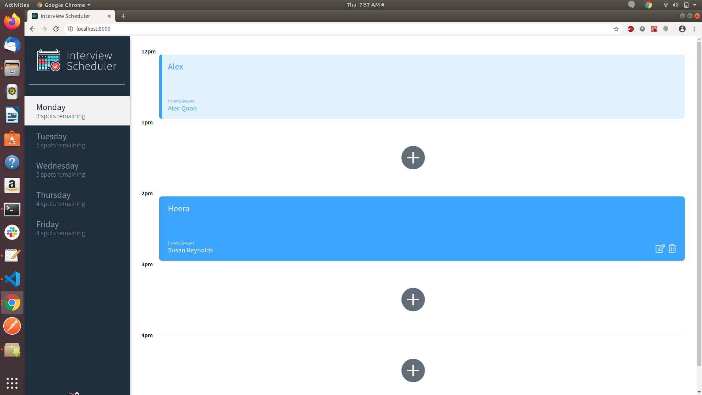
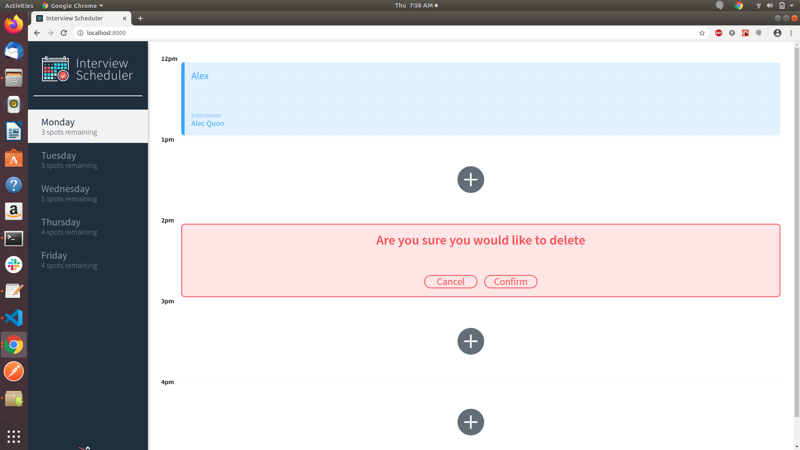
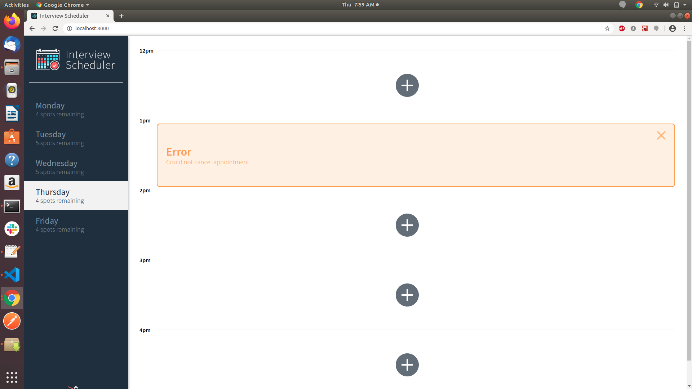

# Interview Scheduler

  Interview Scheduler is a React single page application to book, edit and cancel interviews on week days.

## Setup

Install dependencies with `npm install`.

## Running API server

 clone the repository and do the API serevr setup using the below link.
 <https://github.com/lighthouse-labs/scheduler-api>

## Running Webpack Development Server

```sh
npm start
```

## Running Jest Test Framework

```sh
npm test
```

## Running Storybook Visual Testbed

```sh
npm run storybook
```

## Running Cypress

```sh
npm run cypress
```

## Getting Started

1. Complete the setup and then Go to <http://localhost:8080/> in your browser

## Functionalities

1. User can book an appointment in the available slot
2. User can edit an appointment
3. User can cancel an appointment
4. Details of the number of available spots will be shown for each day

## Final Product









## Dependencies

- react
- react-dom
- axios
- Node 5.10.x or above
- @testing-library/react-hooks
- react-test-renderer
- cypress
- jest
- @storybook
